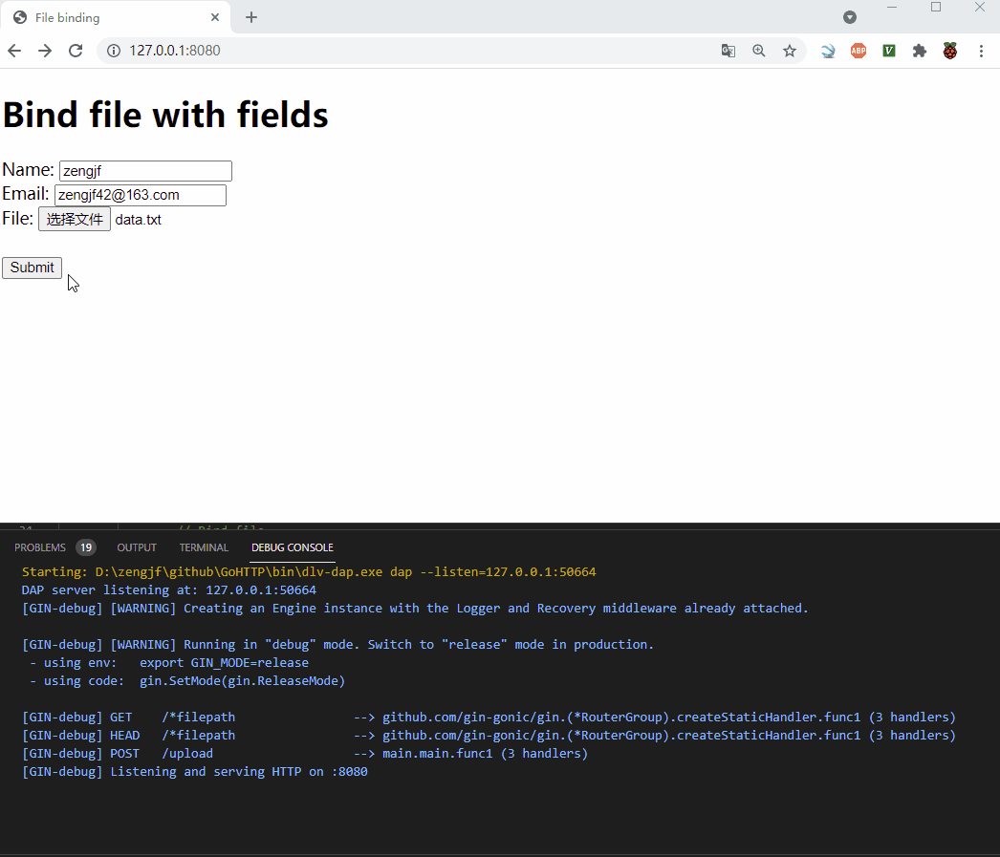

# README

## docs

NO.|文件名称|摘要
:--:|:--|:--
0004| [Bootstrap.md](docs/0004_Bootstrap.md) | 使用Bootstrap设计HTML界面
0003| [RPI4_ENV.md](docs/0003_RPI4_ENV.md) | 树莓派直接运行Go代码配置
0002| [Gin](docs/0002_Gin.md) | VSCode Gin配置
0001| [Enviroment](docs/0001_Enviroment.md) | 环境变量说明

## 目标

## Examples

* [0012_GinBootstrap](src/0012_GinBootstrap)
* [0011_GinWebsocket](src/0011_GinWebsocket)
* [0010_CMD](src/0010_CMD)
* [0009_GinUploadZip](src/0009_GinUploadZip)
* [0008_GinUploadEChart](src/0008_GinUploadEChart)
* [0007_GinTemplateEChart](src/0007_GinTemplateEChart)
* [0006_GinTemplate](src/0006_GinTemplate)
* [0005_GinEChart](src/0005_GinEChart)
* [0004_GinUpload](src/0004_GinUpload)
* [0003_Gin](src/0003_Gin)
* [0002_HTTP](src/0002_HTTP)
* [0001_HelloWorld](src/0001_HelloWorld)
